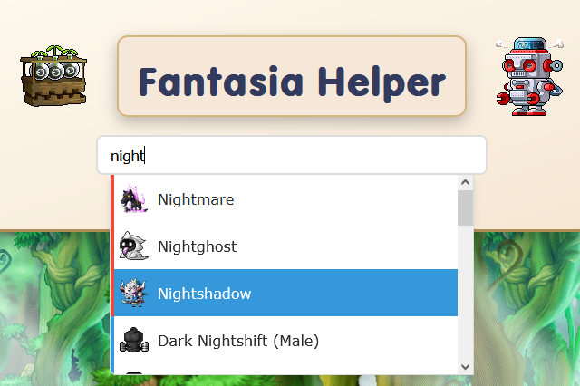
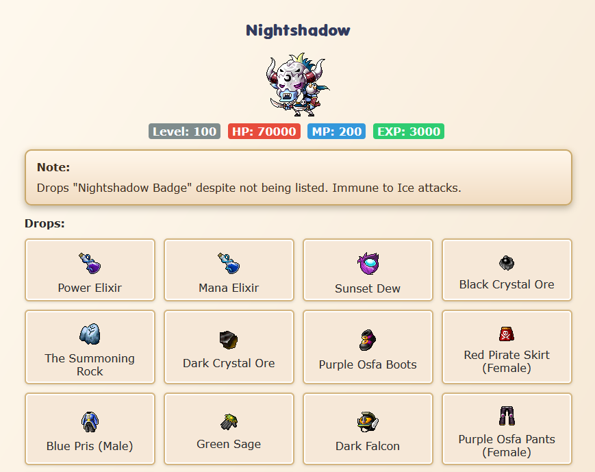
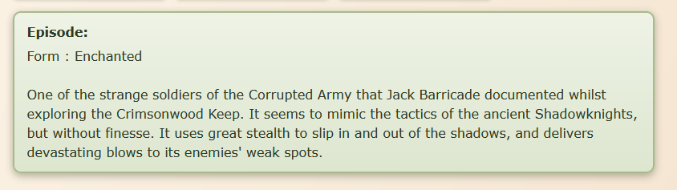
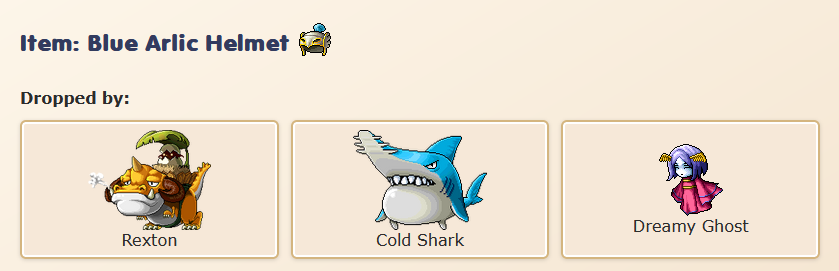

  

# FantasiaHelper

> A website that allows players to see monster drops on the Fantasia Private Server!

## ✨ Features

* Accurate EXP values for every monster in the game
* Monster drop lists sorted from highest to lowest drop rate
* Documented lore for many mobs, written exactly as it appears in the book
* Occasional player notes with useful tips and insights
* Search by monster name **or** item name
* All information is manually verified by me so there are very little mistakes

## 🖼 Images of the site

  
  

  
  

## 💡 Why FantasiaHelper?

FantasiaHelper is built entirely from scratch specifically for Fantasia and it does not rely on or reference vanilla v62 MapleStory data. I believe this is the only way to know for SURE that the information is credible.

That means all information on the site is proven and there are no assumptions and no reused data from other versions/servers.
